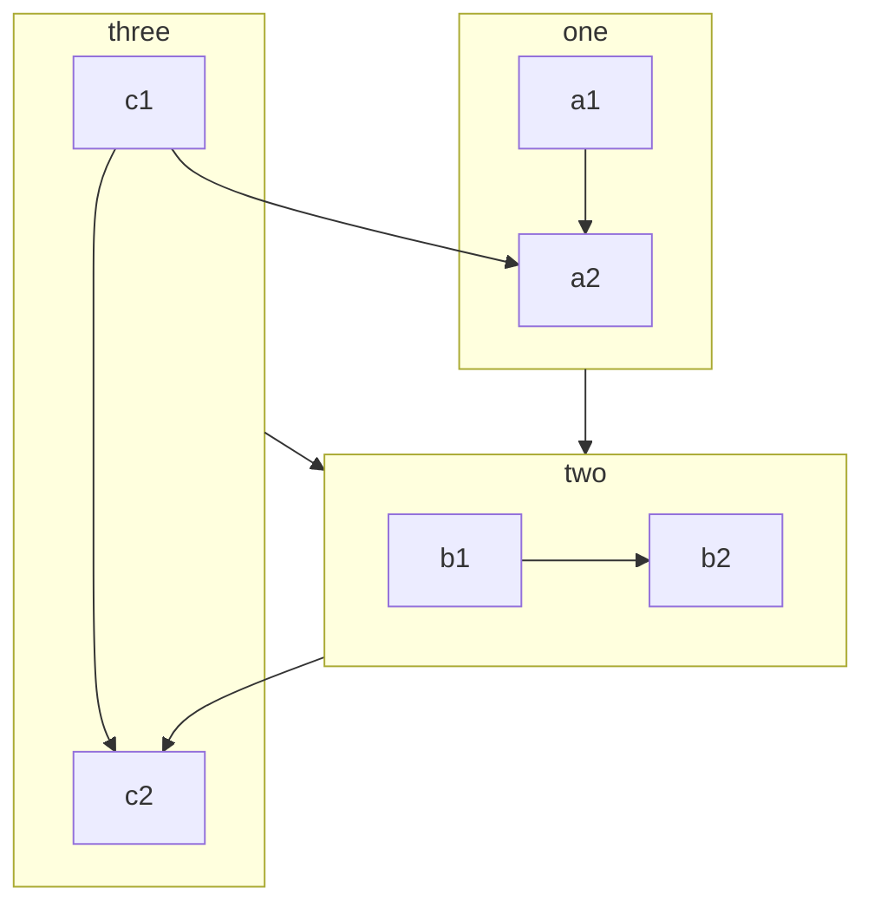

# A evolução da Arquitetura de Software

[^UalterDevmedia]

Logo no nascimento da tecnologia, quando começaram a serem construídas as primeiras soluções automatizadas, a construção de software era tão simples que a tarefa de abstração e definição de sua arquitetura era raramente realizada.

Com o surgimento das aplicações multicamadas, as variações com as quais estas soluções poderiam ser concebidas começaram a crescer exponencialmente. Departamentos de tecnologia responsáveis pela construção começaram a se preocupar e a reconhecer a necessidade da criação de um modelo de aplicação que poderia servir como base para todas as outras. Este modelo poderia definir a natureza das aplicações, como: tecnologia, padrões, regras, limitações e características de design que seriam aplicáveis a todas as soluções baseadas neste template. Isto marcou o nascimento da arquitetura de aplicação, também conhecida como arquitetura de software.

O nível de controle da arquitetura de aplicação pode ser diferente dependendo de cada corporação. Algumas mantêm um nível mais alto, provendo abstrações físicas e lógicas de um modelo de desenvolvimento, enquanto outras incluem informações mais detalhadas, como modelos de dados, diagramas de fluxos de comunicações e requisitos de segurança. Este modelo mais detalhado e específico pode ser mais comum em empresas que adotam diferentes especificações de tecnologias, como Java EE e .Net. Por esta razão, quando existir mais de uma especificação de arquitetura de aplicação dentro de uma organização, existe a necessidade de manter o alinhamento através da governança estabelecida pela arquitetura corporativa.

## Arquitetura Client-Server em uma camada

O início da utilização da computação para automação de processos aconteceu por meio dos grandes computadores, os mainframes. E com eles, a origem da arquitetura, onde todos os aspectos (apresentação, regras de negócio e dados) se localizavam na mesma camada. O mainframe servia a thin-clients, clientes que não possuíam qualquer responsabilidade, máquinas popularmente conhecidas como “terminais-burros”. Seu único papel era possibilitar o acesso ao mainframe, representando a única camada que detinha todas as responsabilidades. Esta abordagem arquitetônica está ilustrada na Figura 1.

Figura 1. Arquitetura Client-Server de uma camada no início da computação com mainframes.

Esta arquitetura Client-Server foi gradativamente sendo abandonada quando uma variação da mesma em duas camadas surgiu no final dos anos 80.

## Arquitetura Client-Server em duas camadas

Esta nova forma de design introduziu o conceito de delegação de responsabilidades para as estações cliente. Responsabilidades como processamento de lógica foram atribuídas para o lado do cliente, nascendo então o fat-client, também conhecido como thick-client. Estes são os clientes mais robustos, incorporados de mais responsabilidades dentro da abordagem de arquitetura.

Nesta arquitetura os clientes (fat-clients) possuem uma responsabilidade maior quanto ao processamento da lógica de aplicação e apresentação. As estações cliente foram impulsionadas principalmente pelo avanço da interface gráfica do usuário (GUI – Graphical User Interface). Este tipo de cliente dominou o mundo de TI no início da década de 90. Na Figura 2 é ilustrada a estrutura em duas camadas para este modelo.

Figura 2. Arquitetura Client-Server em duas camada na evolução da arquitetura de software.

A configuração comum desta arquitetura consistia em múltiplos fat-clients, cada um deles possuindo sua própria conexão de dados com o servidor central. O servidor, por sua vez, detinha escaláveis sistemas de RDBMs (bases de dados relacionais) com alguma lógica de aplicação. Este tipo de arquitetura de software é caracterizado por aplicações monolíticas que controlam e definem a forma como o usuário interage com as aplicações.

Uma das desvantagens desta arquitetura era a existência de uma conexão de base de dados por usuário. Conexões de base de dados eram dispendiosas por natureza, e causavam uma latência de processamento aos usuários. Além disso, as aplicações do lado do cliente tendiam a ser robustas e oneravam com um pesado processamento e armazenamento das regras da aplicação as suas estações de trabalho. Havia ainda a dificuldade de manutenção tanto evolutiva como corretiva, pois todas estas estações deveriam ser individualmente atualizadas no caso de uma necessidade de manutenção.

Outra característica desta arquitetura de aplicação monolítica é a transferência de parte da lógica de aplicação para a base de dados, inserida em Stored Procedures e Triggers, e isto criava um alto acoplamento da solução com a tecnologia.

## Arquitetura Client-Server em múltiplas camadas

O próximo passo da evolução da arquitetura em resposta aos custos e limitações com a Client-Server em duas camadas, foi a criação de múltiplas camadas na divisão das responsabilidades, caracterizando ainda mais um modelo distribuído. Juntamente com esta inovação, o conceito de aplicações baseadas em componentes chegou ao mundo da arquitetura de sofware, quebrando em partes as aplicações monolíticas, formando componentes compatíveis com o paradigma da orientação a objetos.

A distribuição da lógica de aplicacão em múltiplos componentes (alguns no cliente, outros no servidor) facilitou o processo de instalação, centralizando grande parte da lógica nos servidores. Componentes de servidores agora se localizam em Servidores de Aplicação dedicados, que têm a missão de controlar e disponibilizar recursos, como por exemplo, o pool de conexões com a base de dados, aliviando a oneração da criação e acesso concorrente a estes objetos. Desta forma, uma única conexão poderia facilmente servir a múltiplos clientes. A Figura 3 representa graficamente esta nova evolução de arquitetura.

Figura 3. Arquitetura Client-Server em múltiplas camadas, o advento da componentização.

Como sempre, as vantagens vêm acompanhadas com desvantagens, e aplicando este modelo de arquitetura, alguns problemas foram resolvidos, mas outros surgiram. O custo neste caso foi o aumento da complexidade, que impactava o desenvolvimento, implantação e administração das aplicações. Ao invés da comunicação distribuída via conexão com a base de dados, surgiram novos meios de comunicação conhecidos como RPC (Remote Procedure Call), tais como CORBA e DCOM. Estas tecnologias possibilitaram a comunicação remota entre os componentes que residiam nos servidores e estações cliente.

Este modelo de arquitetura em múltiplas camadas se caracteriza pelo surgimento da camada do meio, comumente denominada como middleware. Assim, o esforço de manutenção se elevou, e servidores de aplicações ganharam significativamente mais atenção e relevância em ambientes maiores.

Até esse momento, as tecnologias da Web ainda não faziam parte desse tipo de arquitetura. Foi no final da década de 90 que estas tecnologias se tornaram mais viáveis e começaram a ser incorporadas em soluções que seguiam a arquitetura Client-Server em múltiplas camadas.

O evento mais significante foi a substituição dos componentes de softwares customizados das estações cliente por navegadores (browsers). Este evento, além de mudar e limitar radicalmente o design da interface de usuário, moveu praticamente 100% da lógica de aplicação para o servidor.

## Arquitetura Web distribuída

Esta arquitetura apresenta praticamente a mesma estrutura da arquitetura anterior, porém, com o advento das tecnologias Web, as camadas foram impactadas gerando alterações quanto à responsabilidade contida em cada uma. Isso alterou a abordagem realizada na estruturação do software. Na Figura 4 podemos verificar como ficou esta estruturação.

Figura 4. Arquitetura Web distribuída, o início do uso das tecnologias de Internet na arquitetura.

Com este novo modelo houve a introdução de um novo componente importante e bem conhecido, o Servidor Web, que poderia formar, por si só, uma camada. Isto mudou a comunicação entre servidores e estações cliente, passando de protocolos RPC proprietários (CORBA, DCOM) para o protocolo da World Wide Web, o conhecido HTTP. O protocolo RPC se tornou mais utilizado na comunicação entre servidores Web remotos e Servidores de Aplicação.

Com exceção de algumas tecnologias proprietárias que estendem as funcionalidades dos navegadores, a maioria das soluções deste modelo de arquitetura coloca toda a lógica da aplicação no lado do servidor. Até mesmo as regras de apresentação escritas em linguagens como JavaScript residem no servidor, e são baixadas para o usuário na primeira requisição HTTP, centralizando toda a solução no servidor.

A ênfase maior deste modelo de arquitetura está em definições tais como:

- Estruturar como a aplicação vai ser particionada;
- A responsabilidade de cada uma destas partições, e;
- De que forma elas irão interagir entre si.

Em uma perspectiva estrutural, a arquitetura web distribuída é muito semelhante à arquitetura orientada a serviços. Por exemplo: a lógica é provida pelo servidor e se encontra segmentada em componentes lógicos. A diferença está nos princípios estabelecidos. Para compor a arquitetura web distribuída, a solução se restringe nas três definições anteriormente enfatizadas, enquanto que no SOA há mais considerações a serem abordadas, como todos os princípios que definem a criação de serviços que permitam um ambiente ser orientado por eles.

Do final da década de 90 até a metade da primeira década dos anos 2000, a arquitetura web distribuída representou de fato a arquitetura padrão para o desenvolvimento de soluções corporativas.

Esta arquitetura continua em constante evolução, conforme novas tecnologias surgem e possibilitam pensar de forma diferente alguns detalhes. Como exemplo, tecnologias que possibilitam a construção de Interfaces de Usuário mais ricas, com mais dinâmica e poder de processamento, fazem com que a camada de apresentação tenha mais relevância na separação de responsabilidade entre as camadas. Há também tecnologias que envolvem novas formas de comunicação entre as camadas, como: AJAX, JSON, REST e WebSocket. Este último tem um conceito novo que pode, no futuro, impactar mais forte as soluções de arquitetura, pois se trata de um protocolo bidirecional que permite que a comunicação entre o navegador e servidor Web seja iniciada tanto pelo navegador quanto pelo próprio servidor Web, representando um canal aberto de dupla direção de comunicação.

 [No princípio, um modelo Centralizado baseado no Mainframe](https://www.juliobattisti.com.br/artigos/windows7/anexo/07.asp):

@include(./ref.md{4-})